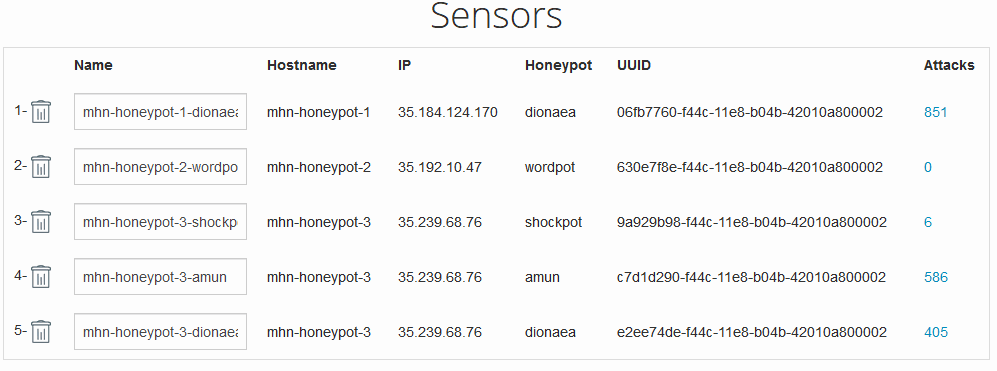
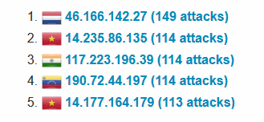
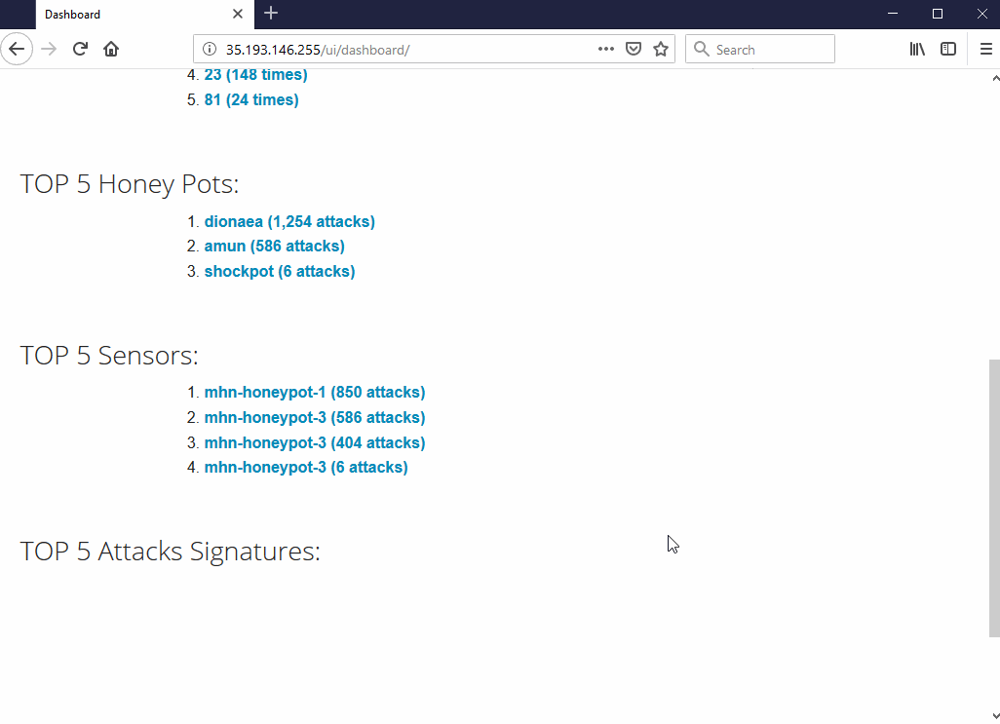

# Week 9 Project: Honeypot

## Which Honeypot(s) you deployed

## Any issues you encountered
- I spent 10 hours to figure it out because it always has some permission denied.

## A summary of the data collected: 
Number of Attacks: 
	
	1846

Top 5 Attacker IPs:

Top 5 Attacked Ports:

| No. | Port | Attack times |
|:---:|:----:|:------------:|
| 1 | 445 | 558 |
| 2 | 8088 | 426 |
| 3 | 5060 | 159 |
| 4 | 23 | 148 |
| 5 | 81 | 24 |

Top 5 Honey spots:

	1.dionaea (1254 attacks)
	2.amun (586 attacks)
	3.shockpot (6 attacks)

## Any unresolved questions raised by the data collected
None.

## License

  Copyright [2018] [Alan Lau]

  Licensed under the Apache License, Version 2.0 (the "License");
  you may not use this file except in compliance with the License.
  You may obtain a copy of the License at

      http://www.apache.org/licenses/LICENSE-2.0

  Unless required by applicable law or agreed to in writing, software
  distributed under the License is distributed on an "AS IS" BASIS,
  WITHOUT WARRANTIES OR CONDITIONS OF ANY KIND, either express or implied.
  See the License for the specific language governing permissions and
  limitations under the License.